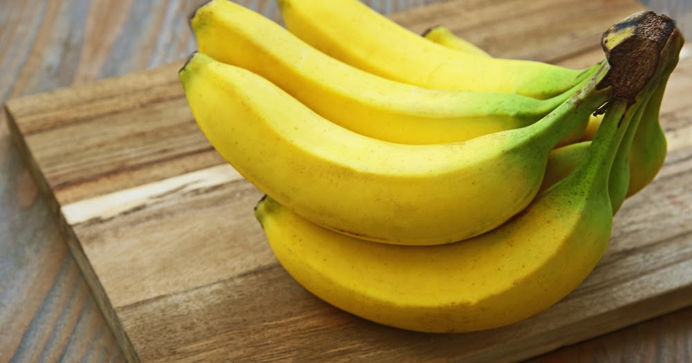

# Laporan Proyek Machine Learning - Nauval Dwi Primadya

# Laporan Proyek Machine Learning - Nauval Dwi Primadya

## Domain Proyek
Domain yang dipilih untuk proyek *machine learning* ini adalah **Pertanian**, dengan judul **Predictive Analytics: Kualitas Buah Pisang**

**Rubrik/Kriteria Tambahan (Opsional)**:

Indonesia merupakan salah satu produsen pisang utama di Asia Tenggara dengan produksi tahunan yang mencapai sekitar 8 juta ton, menjadikannya komoditas pertanian bernilai tinggi yang memberikan kontribusi penting terhadap perekonomian nasional. Pisang memiliki nilai ekonomis yang besar bagi petani lokal, namun industri ini menghadapi tantangan signifikan dalam menjaga mutu produk. Mutu pisang dapat mengalami penurunan akibat sejumlah faktor, seperti ukuran buah yang tidak sesuai standar, tingkat kematangan yang tidak optimal, dan tekstur yang tidak memenuhi kualitas ideal. Penurunan mutu ini dapat menimbulkan dampak ekonomi yang merugikan, baik bagi petani maupun distributoraatan [[1](https://journal.ipb.ac.id/index.php/jagbi/article/view/36753)].
Predictive analytics dalam sektor pisang menunjukkan potensi besar dalam meningkatkan nilai komoditas ini. Teknologi ini dapat membantu petani dengan menjaga kualitas hasil panen, yang pada akhirnya dapat meningkatkan pendapatan mereka. Selain itu, distributor diuntungkan melalui pengurangan risiko kerugian dan peningkatan efisiensi dalam manajemen rantai pasokan. Dari sisi konsumen, teknologi ini memungkinkan akses terhadap pisang berkualitas tinggi dengan harga yang lebih stabil.

## Business Understanding

Pengembangan model prediksi kualitas buah pisang memiliki potensi signifikan untuk memberikan manfaat bagi berbagai pemangku kepentingan, termasuk petani dan distributor. Model ini dapat berfungsi untuk meningkatkan mutu hasil panen pisang, memperkuat nilai ekonomi buah, serta meningkatkan tingkat kepercayaan konsumen. Sebagai contoh, akurasi prediksi kualitas pisang yang tinggi dapat mendukung petani dalam melakukan seleksi buah secara lebih efektif dan memungkinkan penentuan harga jual yang lebih presisi di masa mendatang.

### Problem Statements

Berdasarkan latar belakang yang telah dijelaskan, berikut ini adalah perincian masalah yang dapat diatasi dalam proyek ini:

1.  Bagaimana cara mengembangkan model machine learning untuk memprediksi kualitas pisang berdasarkan data visual dan sensorik?
2.  Model seperti apa yang mampu mencapai tingkat akurasi prediksi tertinggi?
3.  Bagaimana penerapan model ini dapat mendukung petani dan distributor dalam meningkatkan kualitas serta nilai ekonomi dari buah pisang?

### Goals

Berikut adalah tujuan atau hasil yang diharapkan dari masing-masing pertanyaan dalam proyek ini:

1. **Pengembangan model machine learning untuk memprediksi kualitas pisang**  
   - Menghasilkan model machine learning yang dapat menganalisis data untuk memprediksi kualitas pisang secara akurat. Model ini diharapkan mampu mengidentifikasi faktor-faktor yang memengaruhi kualitas pisang sehingga dapat membantu dalam proses seleksi dan pemantauan kualitas.

2. **Menentukan model dengan akurasi prediksi terbaik**  
   - Menemukan model yang memiliki tingkat akurasi paling tinggi melalui evaluasi berbagai algoritma machine learning. Model terbaik akan diidentifikasi berdasarkan hasil uji akurasi dan konsistensinya dalam memprediksi kualitas pisang di berbagai kondisi.

3. **Mengoptimalkan kualitas dan nilai jual pisang bagi petani dan distributor**  
   - Memberikan solusi bagi petani dan distributor untuk meningkatkan kualitas pisang melalui panduan pemilahan dan pengelolaan buah berdasarkan prediksi model. Dengan demikian, model ini diharapkan membantu meningkatkan nilai jual pisang, mengurangi buah yang rusak atau tidak layak jual, dan memperbaiki efisiensi rantai pasokan.

### Solution statements
Melakukan analisis data secara mendalam melalui univariate dan multivariate analysis merupakan langkah penting dalam memahami karakteristik data. Visualisasi data juga digunakan untuk memperoleh pemahaman yang lebih komprehensif, termasuk dalam mengidentifikasi matriks korelasi antar fitur dan mendeteksi keberadaan outlier. 
- Melakukan pembersihan data (_data cleaning_) dan normalisasi data untuk memastikan prediksi yang optimal.
- Mengembangkan beberapa variasi model machine learning untuk membandingkan performa dan menentukan model terbaik dalam memprediksi kualitas pisang. diantaranya adalah :
    * Random Forest
      Random forest adalah salah satu metode machine learning yang digunakan untuk tugas klasifikasi dan regresi [[2](https://repository.uinjkt.ac.id/dspace/handle/123456789/55034)]. Metode ini bekerja dengan menggabungkan beberapa pohon keputusan untuk meningkatkan akurasi dan mengurangi masalah overfitting. Random forest cukup populer karena kemudahan implementasinya, kemampuannya mengatasi ketidakseimbangan data, serta penerapannya pada klasifikasi dengan banyak kelas (multiclass).
    * Gradient Boosting
      Gradient boosting adalah teknik pembelajaran mesin yang sangat efektif dalam meningkatkan kinerja model klasifikasi dan regresi. Teknik ini bekerja dengan menggabungkan beberapa pohon keputusan kecil yang diperbaiki secara iteratif untuk memperoleh model akhir yang lebih akurat. Gradient boosting telah digunakan dalam berbagai aplikasi, termasuk prediksi keberhasilan telemarketing, deteksi penyakit, dan klasifikasi aktivitas fisik [[3](https://ejournal3.undip.ac.id/index.php/gaussian/article/view/31335)].
    * Support Vector Machine
      Support Vector Machine (SVM) adalah algoritma pembelajaran terarah yang digunakan untuk tugas klasifikasi dan regresi. SVM bekerja dengan mencari garis atau hiperseperti yang memaksimalkan jarak antara data dari setiap kelas dalam ruang N-dimensi2. SVM dikenal karena kemampuannya dalam mengatasi masalah klasifikasi linear dan non-linear dengan menggunakan fungsi kernel, seperti kernel linear, polynomial, radial basis function (RBF), atau sigmoid [[4](https://jurnal.umk.ac.id/index.php/ijtis/article/download/7530/pdf)].
    * K-Nearest Neighbors
      K-Nearest Neighbor (KNN) adalah salah satu algoritma machine learning yang digunakan dalam tugas klasifikasi dan regresi. Pendekatan ini dilakukan dengan mencari sejumlah k titik data terdekat dengan data yang ingin diklasifikasikan atau diregresikan. Selanjutnya, KNN memilih kelas atau nilai regresi yang paling sering muncul di antara k titik data tersebut. KNN dikenal karena kesederhanaannya dalam implementasi dan mampu memberikan hasil yang memuaskan, terutama pada dataset yang berukuran relatif kecil [[5](https://journal.ugm.ac.id/ijccs/article/view/65176)].
    * Logistic Regression 
      merupakan salah satu metode statistika yang digunakan untuk memprediksi hasil biner dari suatu variabel dependen berdasarkan satu atau lebih variabel independen. Pendekatan ini telah  menjadi  sangat  populer  dalam  analisis  data  yang  melibatkan  variabel  kategorial  dan  memiliki penerapan yang luas di berbagai bidang disiplin ilmu, termasuk ekonomi, kedokteran, dan ilmu sosial [[6](https://core.ac.uk/download/pdf/327105237.pdf)]

## Data Understanding

### EDA - Deskripsi Variabel

### Informasi Datasets

| Jenis      | Keterangan                                                                 |
|------------|-----------------------------------------------------------------------------|
| Title      | Banana Quality                                                             |
| Source     | [Kaggle](https://www.kaggle.com/datasets/l3llff/banana)                  |
| Maintainer | [l3LlFF](https://www.kaggle.com/l3llff)                                   |
| License    | [Apache 2.0](https://www.apache.org/licenses/LICENSE-2.0)                  |
| Visibility | Publik                                                                      |
| Tags       | _Earth and Nature, Education, Food, Data Visualization, Exploratory Data Analysis, Binary Classification_ |
| Usability  | 10.00                                                                      |

Berikut informasi pada dataset:

| Size       | Weight     | Sweetness | Softness  | HarvestTime | Ripeness   | Acidity   | Quality |
|------------|------------|-----------|-----------|-------------|------------|-----------|--------|
| -1.924968  | 0.468078   | 3.077832  | -1.472177 | 0.294799    | 2.435570   | 0.271290  | Good   |
| -2.409751  | 0.486870   | 0.346921  | -2.495099 | -0.892213   | 2.067549   | 0.307325  | Good   |
| -0.357607  | 1.483176   | 1.568452  | -2.645145 | -0.647267   | 3.090643   | 1.427322  | Good    |
| -0.868524  | 1.566201   | 1.889605  | -1.273761 | -1.006278   | 1.873001   | 0.477862  | Good   |
| 0.651825   | 1.319199   | -0.022459 | -1.209709 | -1.430692   | 1.078345   | 2.812442  | Good   |

**Tabel 1.** Hasil *Exploratory Data Analysis* (EDA) dari deskripsi variabel. Dataset ini telah melalui proses *preprocessing* awal yang mencakup pembersihan dan normalisasi.

- **Tipe Data**: Terdapat tujuh variabel bertipe `float64` dan satu variabel `Quality` yang bertipe `object`. Kolom `Quality` telah diubah menjadi `label` untuk memudahkan analisis.
- **Kondisi Data**:
  - **Missing Values**: Tidak ditemukan nilai yang hilang di seluruh kolom dataset.
  - **Duplicate Values**: Tidak ada data duplikat yang ditemukan.

Untuk outliers, metode dropping berbasis Interquartile Range (IQR) digunakan, dengan menghitung IQR sebagai selisih antara kuartil ketiga (Q3) dan kuartil pertama (Q1):

$$IQR = Q_3 - Q_1$$

Setelah menghapus outliers, jumlah data berkurang dari `8.000` menjadi `7.645`. Data dibagi menjadi data latih dan data uji dengan rasio 80:20 menggunakan fungsi *Train Test Split* dari library *sklearn.model_selection*, dengan random state sebesar 42. Normalisasi dilakukan menggunakan *MinMaxScaler* dari library *sklearn.preprocessing*.

- **Distribusi Data**: Analisis univariat menunjukkan bahwa distribusi variabel numerik simetris dan mendekati normal setelah normalisasi. Untuk data kategorikal, distribusi kualitas _Good_ (4006) dan _Bad_ (3994) cukup seimbang.
  
- **Korelasi Antar Variabel**: Analisis menunjukkan beberapa korelasi moderat, seperti antara Size dan HarvestTime (0,58) serta Ripeness dan Acidity (-0,35). Sebagian besar variabel lainnya menunjukkan korelasi lemah.

### Variabel-variabel pada dataset adalah sebagai berikut:
Dataset terdiri dari 8 kolom:

- **Size**: ukuran buah
- **Weight**: berat buah
- **Sweetness**: tingkat kemanisan
- **Softness**: kelembutan
- **HarvestTime**: waktu pascapanen
- **Ripeness**: tingkat kematangan
- **Acidity**: tingkat keasaman
- **Quality**: kualitas buah (label ini dirubah menjadi `label`).

### EDA - Univariate Analysis

**Gambar 1.1.** Analisis Univariat (Data Kategori)

**Gambar 1.2.** Analisis Univariat (Data Numerik)

Berdasarkan **Gambar 1.1**, distribusi data kategorik menunjukkan jumlah data **bad** sebanyak `3994` dan **good** sebanyak `4006`, dengan perbandingan yang hampir seimbang. 

Pada **Gambar 1.2**, distribusi variabel numerik mencerminkan karakteristik statistik setelah normalisasi. Berikut adalah hasil observasi dari masing-masing variabel:

- **Size**: ukuran rata-rata buah terletak di rentang -2 hingga 2, dengan persebaran simetris.
- **Weight**: distribusi berat buah simetris di sekitar nol, mayoritas nilai antara -2 dan 2.
- **Sweetness**: kemanisan juga terkonsentrasi di antara -2 hingga 2.
- **Softness**: menunjukkan sedikit asimetri, mencerminkan variasi tekstur.
- **HarvestTime** dan **Ripeness**: pola distribusi simetris sekitar nol.
- **Acidity**: tingkat keasaman simetris di sekitar nol, rentang antara -2 hingga 2.

Dari analisis ini, dataset dinyatakan telah dinormalisasi menggunakan metode z-score normalization, memungkinkan analisis komparatif antar variabel.

### EDA - Multivariate Analysis

**Gambar 2.1.** Analisis Multivariat

**Gambar 2.2.** Analisis Matriks Korelasi

Pada **Gambar 2.1**, matriks scatterplot menunjukkan hubungan antar delapan variabel, tanpa pola linier yang kuat. 

Di **Gambar 2.2**, matriks korelasi mengungkap hubungan linier variabel numerik. Temuan utama termasuk:

1. **Size dan HarvestTime** memiliki korelasi positif kuat (0,58).
2. **Weight dan Sweetness** menunjukkan korelasi positif moderat (0,4).
3. **Ripeness dan Acidity** memiliki korelasi negatif (-0,35).
4. **Size dan Sweetness** menunjukkan korelasi negatif (-0,27).
5. Sebagian besar variabel lain menunjukkan korelasi lemah.

Analisis ini memberikan wawasan tentang hubungan antar variabel yang dapat dieksplorasi lebih lanjut dalam penelitian karakteristik buah dalam dataset ini.

## Data Preparation
Pada bagian ini dilakukan langkah-langkah untuk mempersiapkan data, termasuk proses data gathering, data assessing, dan data cleaning agar dataset siap digunakan dalam pemodelan.
Tahapan Persiapan Data
1. Pengubahan Tipe Kolom: Kolom Quality diubah namanya menjadi label dan tipe datanya diubah menjadi category untuk mempermudah pengolahan data.
2. Pembagian Data (Train-Test Split): Dataset dibagi menjadi data latih dan data uji menggunakan fungsi train_test_split dari library sklearn.model_selection, dengan rasio 80:20 dan random state sebesar 42. Langkah ini dilakukan untuk menghindari data leakage.
3. Normalisasi Data: Normalisasi diterapkan menggunakan MinMaxScaler untuk menyelaraskan rentang nilai tiap fitur, sehingga variabel memiliki skala yang seragam dan sebanding.

## Modeling

### Random Forest
- **Konfigurasi**  
  Random Forest dipilih karena kemampuannya dalam menangani dataset berdimensi tinggi dan ketahanannya terhadap nilai ekstrem. Model ini dikonfigurasi dengan parameter `n_estimators=100`, yang menunjukkan jumlah pohon yang dibangun, dan `max_depth=10`, yang membatasi kedalaman pohon untuk menghindari overfitting. Parameter `random_state=42` ditambahkan untuk menjaga konsistensi hasil eksperimen.

- **Cara Kerja**  
  Random Forest membangun sejumlah pohon keputusan secara acak dan menggabungkan hasil prediksi dari masing-masing pohon untuk meningkatkan akurasi. Dengan mengintegrasikan hasil dari beberapa pohon, teknik ini juga mengurangi risiko overfitting melalui rata-rata hasil prediksi.

- **Kelebihan**
  1. Mampu menangani data berdimensi tinggi dengan baik.
  2. Tahan terhadap outlier dan lebih stabil dibandingkan model pohon tunggal.
  3. Dapat mengelola data dengan berbagai tipe fitur.

- **Kelemahan**
  1. Memerlukan lebih banyak sumber daya komputasi karena keberadaan banyak pohon dalam ensemble.
  2. Interpretasi hasil lebih kompleks dibandingkan model pohon tunggal.

### Gradient Boosting
- **Konfigurasi**  
  Gradient Boosting menggunakan parameter `learning_rate=0.1`, yang mengontrol kontribusi setiap pohon baru dalam memperbaiki kesalahan model sebelumnya, dan `n_estimators=100`, yang menunjukkan jumlah pohon dalam ensemble. Penetapan `random_state=42` memastikan hasil eksperimen yang konsisten.

- **Cara Kerja**  
  Gradient Boosting beroperasi secara iteratif, di mana setiap model baru dirancang untuk memperbaiki kesalahan dari model sebelumnya. Dengan menambahkan model baru untuk mengatasi kesalahan, akurasi meningkat secara bertahap dengan setiap iterasi dalam ensemble.

- **Kelebihan**
  1. Sangat akurat, terutama pada data yang kompleks.
  2. Mengatasi masalah underfitting melalui proses iteratif.

- **Kelemahan**
  1. Rentan terhadap overfitting jika parameter tidak diatur dengan baik.
  2. Cenderung memerlukan waktu lebih lama dalam proses pelatihan dibandingkan dengan model lain.

### Support Vector Machine (SVM)
- **Konfigurasi**  
  SVM diterapkan dengan kernel RBF (`kernel='rbf'`) untuk mengakomodasi data berdimensi tinggi dan data non-linier. Parameter `C=1.0` digunakan sebagai regulasi untuk mengontrol margin antara kelas, sedangkan `gamma='scale'` menyesuaikan nilai gamma secara otomatis pada data kompleks. Fitur `probability=True` diaktifkan untuk memungkinkan prediksi probabilitas.

- **Cara Kerja**  
  SVM memisahkan data berdasarkan hyperplane yang memaksimalkan margin antar kelas. Kernel RBF memungkinkan model ini untuk menangani data dengan pola non-linier, sehingga memberikan fleksibilitas dalam pemisahan data.

- **Kelebihan**
  - Sangat efektif untuk data berdimensi tinggi.
  - Memiliki kinerja yang baik pada data dengan batas pemisah yang jelas.

- **Kelemahan**
  - Kurang efisien pada dataset besar dalam hal waktu dan memori.
  - Pemilihan parameter `C` dan `gamma` cukup sensitif dan dapat mempengaruhi hasil model secara signifikan.

### K-Nearest Neighbors (KNN)
- **Konfigurasi**  
  Nilai `K=5` dipilih setelah evaluasi kinerja model pada berbagai nilai K untuk mencapai akurasi optimal.

- **Cara Kerja**  
  KNN mengklasifikasikan sampel uji berdasarkan kelas mayoritas dari lima tetangga terdekat, yang memungkinkan klasifikasi berdasarkan kemiripan data. Pendekatan ini memfasilitasi klasifikasi berdasarkan kedekatan atau kemiripan dalam fitur data.

- **Kelebihan**
  1. Sederhana dan mudah diimplementasikan.
  2. Tidak memerlukan pelatihan, sehingga lebih cepat untuk diterapkan pada dataset kecil.

- **Kelemahan**
  1. Sensitif terhadap skala fitur dan outlier.
  2. Kurang efisien pada dataset besar karena harus menghitung jarak ke setiap titik data lain dalam dataset.

### Logistic Regression
- **Konfigurasi**  
  Logistic Regression digunakan sebagai model baseline yang sederhana dan mudah diinterpretasikan. Parameter `max_iter=1000` diatur untuk memungkinkan konvergensi pada dataset yang lebih besar, dan `random_state=42` digunakan untuk hasil yang konsisten.

- **Cara Kerja**  
  Logistic Regression menghasilkan probabilitas untuk klasifikasi biner dengan menggunakan fungsi sigmoid, dan bekerja optimal pada data dengan batas pemisah linier. Model ini menghasilkan prediksi probabilitas untuk setiap kelas, memungkinkan klasifikasi dengan interpretasi yang mudah.

- **Kelebihan**
  1. Mudah diinterpretasikan dan cukup cepat dalam proses pelatihan.
  2. Bekerja dengan baik pada data yang memiliki batas pemisah linier.

- **Kelemahan**
  1. Kurang efektif untuk data yang tidak linier.
  2. Lebih mungkin mengalami underfitting pada data yang kompleks dan berdimensi tinggi.

Setelah pemilihan model dan konfigurasi, setiap model dievaluasi menggunakan metrik seperti akurasi, presisi, recall, dan F1-score untuk menentukan model dengan performa terbaik pada dataset ini.

## Evaluation
Pada tahap evaluasi model, metrik yang digunakan adalah *accuracy*, yang mengukur persentase prediksi yang benar dari keseluruhan prediksi yang dilakukan oleh model. Rumus untuk menghitung akurasi adalah sebagai berikut:

$$\text{Accuracy} = \frac{\text{TP + TN}}{\text{TP + TN + FP + FN}} \times 100\%$$

**Penjelasan Komponen:**
- **TP (True Positive):** Jumlah data positif yang diklasifikasikan dengan benar sebagai positif.
- **TN (True Negative):** Jumlah data negatif yang diklasifikasikan dengan benar sebagai negatif.
- **FP (False Positive):** Jumlah data negatif yang salah diklasifikasikan sebagai positif (Kesalahan Tipe I).
- **FN (False Negative):** Jumlah data positif yang salah diklasifikasikan sebagai negatif (Kesalahan Tipe II).

Rumus ini menghitung persentase prediksi yang benar dibandingkan dengan keseluruhan prediksi, menyajikan hasil dalam bentuk persentase.

Di bawah ini adalah hasil *accuracy* dari lima model yang digunakan dalam proyek ini:

| Model                        | Accuracy |
|------------------------------|----------|
| K-Nearest Neighbors (KNN)    | 0.98     |
| Random Forest                | 0.97     |
| Support Vector Machine (SVM) | 0.99     |
| Gradient Boosting            | 0.95     |
| Logistic Regression          | 0.87     |

Dari tabel tersebut, *Support Vector Machine (SVM)* menunjukkan akurasi tertinggi, diikuti oleh *K-Nearest Neighbors (KNN)* dan *Random Forest*. Ketiga model ini paling efektif dalam memprediksi kualitas pisang, yang sejalan dengan tujuan proyek untuk meningkatkan kualitas dan nilai jual pisang bagi petani dan distributor.

### Diskusi Hasil Proyek terhadap Problem Statement dan Goals

Hasil evaluasi model menunjukkan bahwa akurasi tinggi dari SVM, KNN, dan Random Forest dapat secara langsung mendukung tujuan ketiga proyek ini. Dengan model yang mampu memprediksi kualitas pisang secara akurat, petani dan distributor dapat:

- **Seleksi Buah yang Lebih Efisien**: Dengan akurasi model yang tinggi, petani dapat lebih percaya diri dalam memilih buah yang berkualitas untuk dipasarkan. Ini mengurangi risiko menjual buah yang tidak memenuhi standar kualitas.
  
- **Mengurangi Kerugian**: Dengan mengidentifikasi pisang yang tidak layak jual lebih awal, petani dapat mengurangi jumlah buah yang dibuang atau dijual dengan harga rendah, sehingga meningkatkan profitabilitas.

- **Meningkatkan Nilai Jual**: Dengan memisahkan buah berdasarkan kualitas dengan lebih baik, distributor dapat menawarkan produk yang lebih baik kepada konsumen, meningkatkan kepuasan pelanggan dan mempertahankan loyalitas di pasar.

Secara keseluruhan, hasil proyek ini menunjukkan bahwa pengembangan model prediksi tidak hanya berhasil mencapai akurasi yang tinggi, tetapi juga memberikan manfaat praktis bagi petani dan distributor. Dengan demikian, proyek ini memiliki potensi untuk meningkatkan kualitas dan nilai ekonomis buah pisang dalam rantai pasokan.

## Referensi
1. [Aurelia, R., Kurniati, D., & Hutajulu, J. P. (2022). Daya Saing Ekspor Pisang Indonesia Di Negara Tujuan Ekspor Periode 2000-2019. Jurnal Agribisnis Indonesia (Journal of Indonesian Agribusiness), 10(2), 335-349.](https://journal.ipb.ac.id/index.php/jagbi/article/view/36753)
2. [Fadilah, L. (2018). Klasifikasi Random Forest pada data imbalanced (Bachelor's thesis, Fakultas Sains dan Teknologi UIN Syarif Hidayatullah Jakarta).](https://repository.uinjkt.ac.id/dspace/handle/123456789/55034)
3. [Suryana, S. E., Warsito, B., & Suparti, S. (2021). Penerapan Gradient Boosting Dengan Hyperopt Untuk Memprediksi Keberhasilan Telemarketing Bank. Jurnal Gaussian, 10(4), 617-623.](https://ejournal3.undip.ac.id/index.php/gaussian/article/view/31335)
4. [Handayani, P. K. (2021). Penerapan Algoritma Support Vector Machine (Svm) Untuk Analisis Pola Klasifikasi Pada Parkinson’S Dataset. Indonesian Journal of Technology, Informatics and Science (IJTIS), 3(1), 31-35.](https://jurnal.umk.ac.id/index.php/ijtis/article/download/7530/pdf)
5. [Isnain, A. R., Supriyanto, J., & Kharisma, M. P. (2021). Implementation of K-Nearest Neighbor (K-NN) algorithm for public sentiment analysis of online learning. IJCCS (Indonesian Journal of Computing and Cybernetics Systems), 15(2), 121-130.](https://journal.ugm.ac.id/ijccs/article/view/65176)
6. [Setyati, W. A., Sunaryo, S., Rezagama, A., Widodo, A. K., & Yulianto, M. F. A. (2020). PENERAPAN REGRESI LOGISTIK DALAM PENENTUAN FAKTOR YANG MEMPENGARUHI JUMLAH WISATAWAN ECOTOURISM DESA BEDONO. Jurnal Enggano, 5(1), 11-22.](https://core.ac.uk/download/pdf/327105237.pdf)

